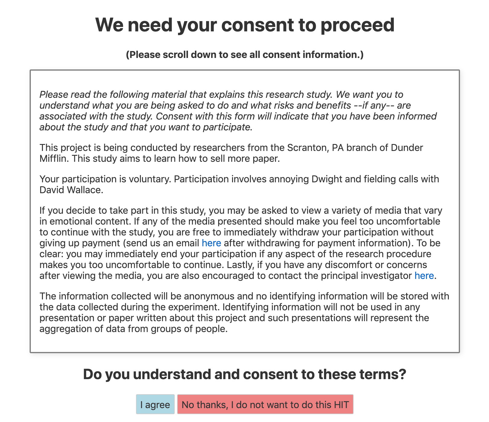

# Using development mode

## Getting development mode running

After setting up Firebase and editing the `src/utils.js` file, `continuous-rater` is ready to be used in development mode! Development mode allows you to tweak and test your customized app locally (using a local host on your browser of choosing) and view changes every time a file is altered and saved. 

If this is your first time running development mode, `cd` into your `continuous-rater` repository and use the command line to run 

```
npm install
``` 

which will install the necessary dependencies. Then run 

```
npm run dev
```

and navigate to [localhost:5000](http://localhost:5000) in your browser. You should now see your customized web app, which should display some version of a consent landing page like this (but with your variables filled in):



## Testing the app in development mode

As you progress through various stages of the app in development mode, Firebase will record data for a test worker. This allows you to validate data collection for yourself and check how various components of the app are working together. However, you may want to occasionally delete any test data and start fresh. In order to do this, simply click the header that says **Dev mode (click here to reset test subject)**. Clicking this will delete and reset all data associated with the test worker stored in Firebase and restart the app at the consent stage. 

The ability to rest test worker data is of particular importance because Firebase keeps track of which stimuli have already been viewed by a particular subject and won't allow for repeat viewings. Therefore, in order to continue testing after the test worker has seen all stimuli, you must reset the data associated with the test worker.