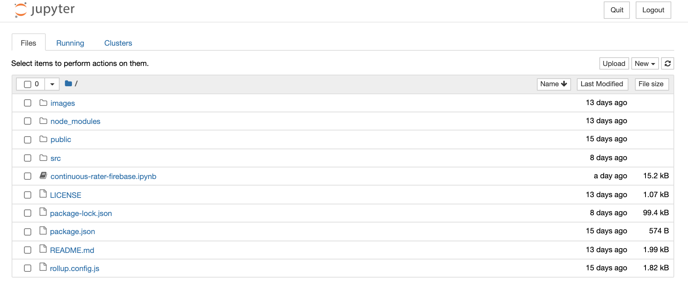
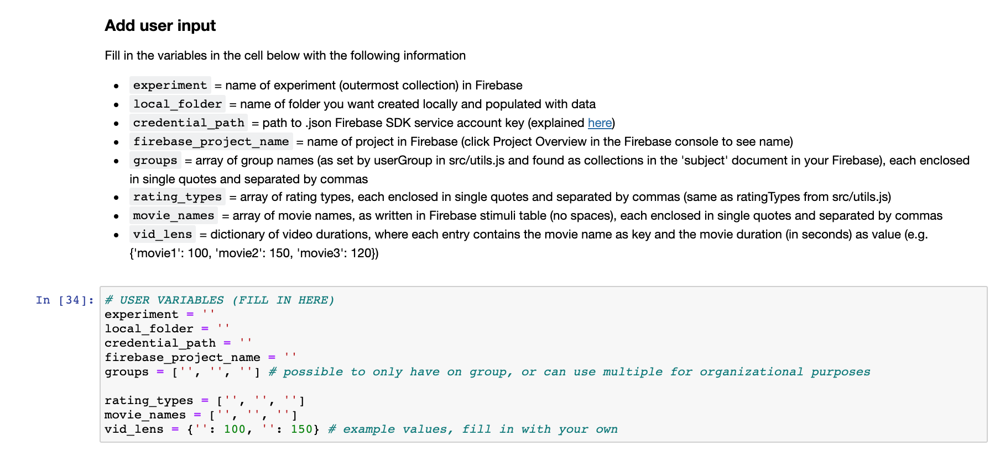

# Pulling data from firebase

Included in the github repo is a jupyter notebook file, `continuous-rater-firebase.ipynb`. This contains python code pre-structured to help grab collected data from Firebase, download it locally, and wrangle it into various formats for analysis. 

If you execute all cells in the notebook, you will obtain a long-format file of all subject ratings containing all relevant information. 

```{note}
This notebook removes subjects who started (but did not complete) the task. It still records them in a separate folder (called Incomplete within the Subjects folder), but does not include their ratings in the file long-format file.
```

## Getting started with jupyter notebooks
If you have never used a [jupyter notebook](https://jupyter.org/) (a mix of interactive code and markdown cells) before, and don't have the necessary software installed, I recommend downloading [Anaconda](https://www.anaconda.com/products/individual). Once fully installed, go to your command line and cd into the `continuous-rater` repository. Then, run the following line of code:

```
jupyter notebook
```

This should open a GUI using a local host in your default browser and look something like this:



Click and open the `continuous-rater-firebase.ipynb` file.


## Using the included jupyter notebook

The included notebook contains cells of python code, labeled by function. In order to execute a cell, you can click on it and then press `shift` + `enter`. The cells should be run in order to ensure all necessary variables are instantiated properly. 

You should see a section of the notebook that looks like this:



Similar to the `src/utils.js` file, this notebook contains some variables that require user input. Please read the markdown description of each variable carefully and fill in accordingly. 

Some notes:

- **`local_folder`**: this folder does not need to already exist. The notebook will create it for you, add it to your `continuous-rater` repo (unless you change the path to have it created elsewhere), and populate it with the necessary sub-folders and files. ***Add this folder to your `.gitignore` to ensure you don't upload confidential subject data to github.*** The data files can also be quite large
- **`credential_path`**: finding/generating your Firebase SDK credentials is described below 

## Setting up Firebase Admin SDK credentials

First, you must install the Firebase Admin SDK. From a command line, run:

```
pip install firebase-admin
```

Next, you need to initialize the SDK for your project. Here are the steps to do so, taken from Google's tutorial (found [here](https://firebase.google.com/docs/admin/setup#initialize-sdk)):

1. In the Firebase console, open **Project settings** and then navigate to the **Service accounts** tab<p>&nbsp;</p>

2. Click **Generate new private key**, then confirm by clicking **Generate key**<p>&nbsp;</p>

3. Save this .json file somewhere secure ***outside of your `continuous-rater` repository*** (to ensure it is not accidentally uploaded to git)<p>&nbsp;</p>

4. Set the `credential_path` variable in the jupyter notebook as the path to this .json file<p>&nbsp;</p>


```{note}
This jupyter notebook will not work properly unless all variables in the USER VARIABLES cell are filled in correctly. Please ensure accuracy and completeness. 
```


