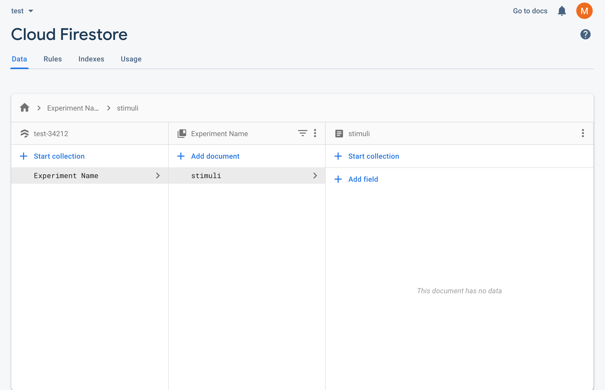
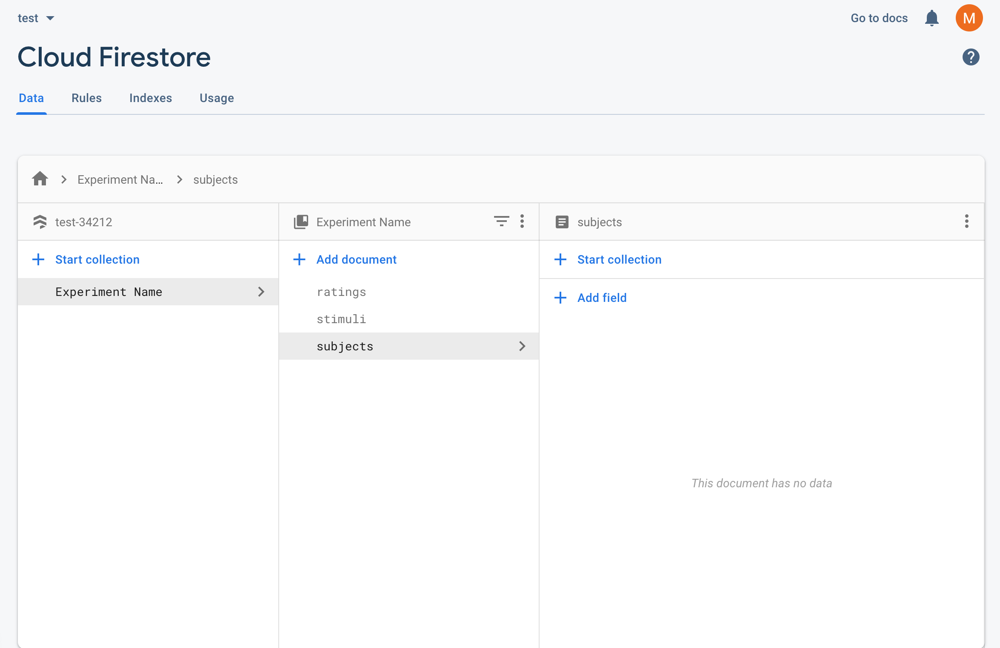

# Initializing Cloud Firestore

`continuous-rater` relies on Google Firebase to store and access information about subjects, ratings and stimuli. Firebase offers a generous free tier and is cost-effective to scale. To get started, click [here](https://console.firebase.google.com/) and sign into the console with a Google account. Here's how you get set up:

1. Press the <strong>Create a project</strong> button and follow the prompts until your project is initialized (I recommend the default options provided).<p>&nbsp;</p>  


2. Open your new project and click the <strong>Develop</strong> tab in the left-side menu.<p>&nbsp;</p>


3. Under <strong>Develop</strong>, click **Authentication** and then navigate to the **Sign-in method** tab.<p>&nbsp;</p> 


4. Edit the **Email/Password** option and toggle the top **Enable** switch to on. Press **Save**.<p>&nbsp;</p>


5. Back under the **Develop** tab, click **Cloud Firestore** and then click the **Create database** button. Change the security rules option to **Start in test mode** and press **Next**. Keep the default location, and then press **Enable**.<p>&nbsp;</p>


6. After a brief loading period, you should see your Cloud Firestore database! Start by navigating to the **Rules** tab right under Cloud Firestore. Copy and paste the following code over the current rules, and then press **Publish**.
	
	```
	rules_version = '2';
	service cloud.firestore {
 		match /databases/{database}/documents {
    		match /{document=**} {
      			allow read, write: if request.auth.uid != null
    		}
  		}
	}
	```
	<p>&nbsp;</p>
7. Navigate back to the **Data** tab (directly left of **Rules**) within Cloud Firestore and press **+ Start collection**. Name this collection with the name of your experiment (you will later provide this exact name to the `src/utils.js` file). When prompted to add a document, provide 'stimuli' as the **Document ID** (IMPT: must be exact, case-sensitive). Do not provide a field. Press **Save**. You should now have a Firestore that looks similar to this:<p>&nbsp;</p>

	<p>&nbsp;</p>
	

8. Using the **+ Add document** button (located directly above the 'stimuli' document), add one document with the ID 'ratings' and another document with the ID 'subjects' (IMPT: again, must be exact, case-sensitive). Your Firestore should now look like this:<p>&nbsp;</p>

	<p>&nbsp;</p>
	
	
9. <a name="firebase-config"></a>Finally, navigate to **Settings** by clicking the gear icon next to **Project Overview** in the left-hand menu, and then pressing **Project settings**. In the **General** tab, scroll down and click the blue circular HTML icon (< / >). Nickname your app with the name of your experiment, but do not add Firebase Hosting. Press **Register app**. When you get to **Add Firebase SDK**, DO NOT copy and paste the provided scripts into your app. Instead, press **Continue to console**. Then, under the **Firebase SDK snippet**, select **Config** (instead of **CDN**), and copy/paste that code snippet somewhere easy to access. You will use it later to configure the `src/utils.js` file that connects your app to your Firebase.<p>&nbsp;</p>

10. Once you complete these steps, your backend is set up! If you run out of read/write capacity within Firestore on the stock free plan, you can upgrade to a paid version. See details [here](https://firebase.google.com/pricing?authuser=0).

